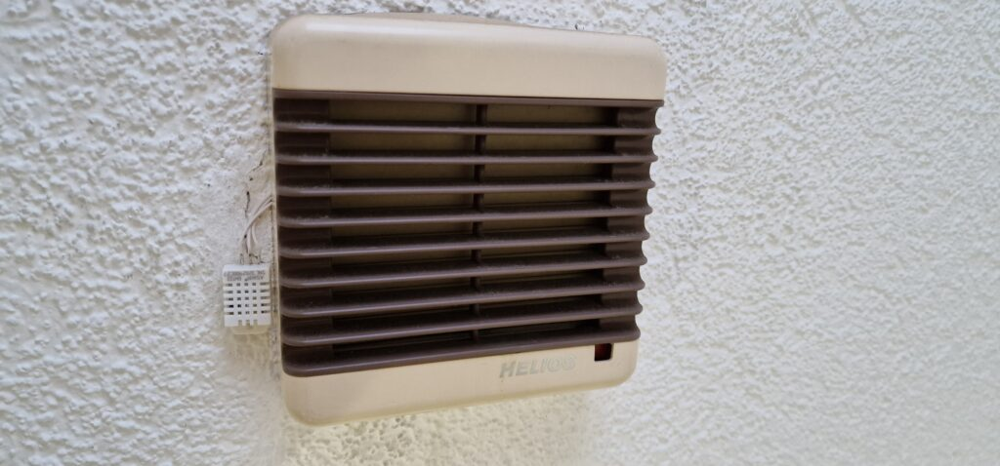
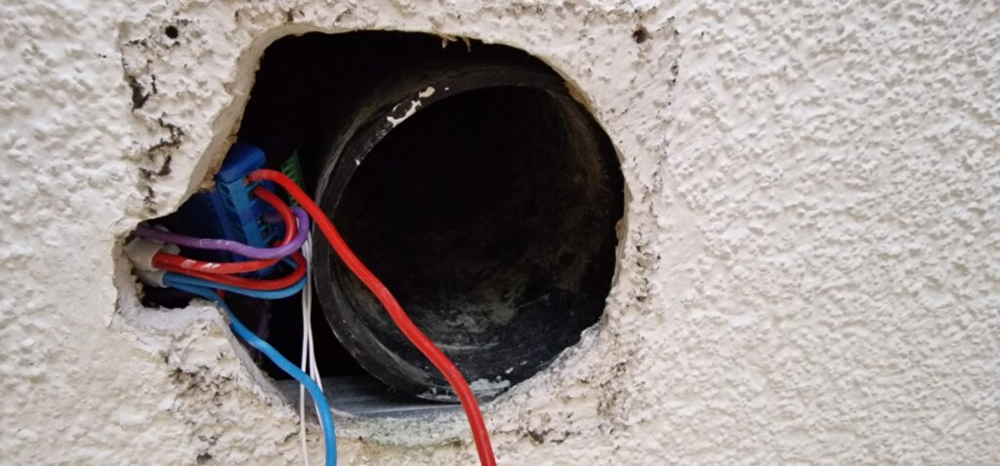
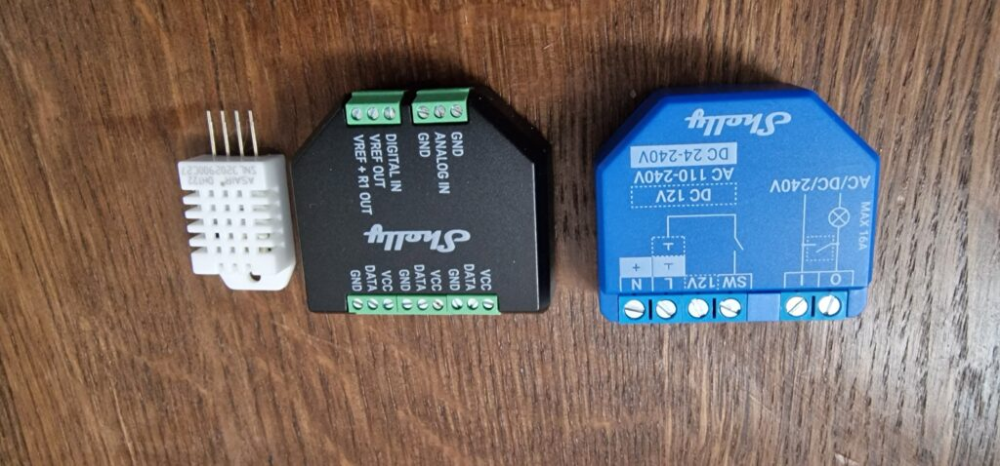
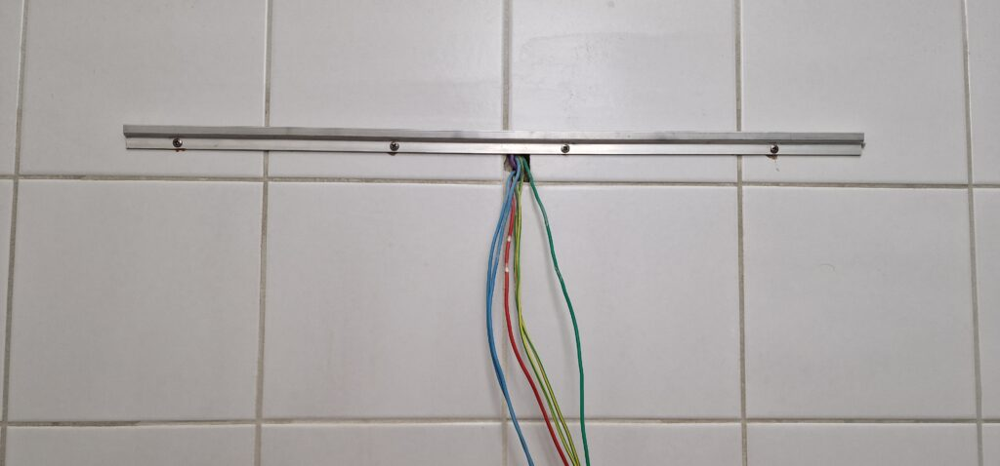

Der Lüfter in meinem Badezimmer (Prüfsiegel 1989) hatte einmal einen Nachlauf, der war aber erstens nicht richtig angeschlossen, und hat danach dann doch nicht (mehr) funktioniert. Zudem war der Draht, der Dauerspannung führen sollte, hinter dem Spiegelschrank gar nicht angeschlossen...

<!--more-->

Nachdem zum Lüfter Dauerspannung geführt wurde, konnte mit einem Shelly 1 Plus, Addon Board und einem DHT22 Luftfeuchte/Temparatursensor nicht nur ein stupider Nachlauf, sonder eine komplexe Luftfeuchigkeitsabhängige Steuerung eingerichtet werden.

- Auf Schaltereingaben wird immer Reagiert

- Übersteigt die Feuchtigkeit einen Wert x schaltet der Lüfter an

- Sinkt sie unter einen Wert Y schaltet der lüfter aus

- Schaltereingaben und Automatisch Ein pausieren die Automatik für eine bestimmte Zeit

```
let blocktime = 15 * 60 * 1000;  //15Min
let humidity_on = 65;          //Upper Limit, start Fan
let humidity_off = 60          //Lower Limit, stop Fan

let suspended = false          //indicate suspension. When Fan is switched, for "blocktime" no further automatic switching
let timer = null;              

//reset automatic switching
function reset(){
  suspended =  false;
  Timer.clear(timer);
  print("Autmation reenabled");
}

//suspend automatic switching for "blocktime"
function suspend(){
  print("Suspend automation");
  suspended = true;
  if(timer)Timer.clear(timer);
  timer=Timer.set(blocktime,false,reset);
}

Shelly.addEventHandler(function(e){
    //Manual switching disables automation for "blocktime"
    if(e.component==="switch:0"){
        suspend();
    }
    if(!suspended){
      if(e.info.event == "humidity_measurement"){
        if(e.info.rh>humidity_on){
            Shelly.call("Switch.set", {'id': 0, 'on': true});
            print("automatic turn on");
            suspend();
        }
        if(e.info.rh<humidity_off){
            Shelly.call("Switch.set", {'id': 0, 'on': false});
            print("automatic turn off");
            //not suspending
        }
      }
    }
  }
);
```








